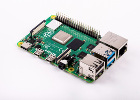
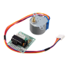
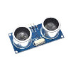

# bin
bin des scripts relatifs à la raspberry Pi (moteurs, capteurs, etc...)

Le fichier start.py appel tous les autres scripts:
-	strl2Roues.py 	: avance, recule, gauche et droite de 2 roues latérales (moteurs pas à pas controlés par ULN2003)
-	captHC.py 	: mesure de la distance avec capteur HC-SR04 ultrasons
-	autoHC.py	: avance un peu, s'arrete, prend la distance, et reavance ... jusqu'à ce que distance < distance donnée de sécurité collision
-	reset.py	: Heu... Reset

* puis Bien des nouveaux scripts à venir...
